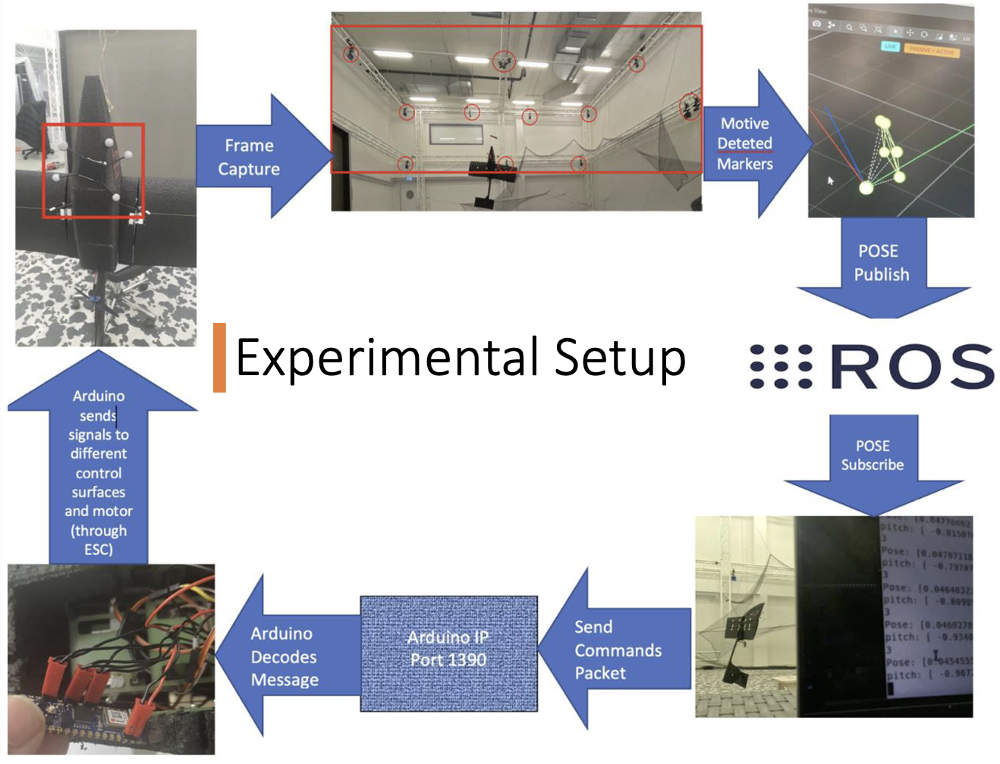

# Vertical Hovering Fixed-Wing Drone

A control system for achieving stable vertical hovering in fixed-wing drones using PID controllers and motion capture feedback.

## Project Overview

This project develops control strategies for fixed-wing UAVs to achieve stable vertical hovering, focusing on attitude control and position stabilization. Two platforms were used: Flatty (conventional front-propeller) for validation and Perchug (rear-propeller pusher configuration).

## Control Architecture

### PID Controller System
The system uses 6 PID controllers for complete hovering control:

1. **Roll Control**: Maintains constant roll using aileron deflection
2. **Altitude Control**: Z-position control via throttle command
3. **Pitch Control**: Cascaded PID (outer: x-position, inner: pitch angle)
4. **Yaw Control**: Cascaded PID (outer: y-position, inner: yaw angle)

### Control Loop Structure
```
Reference → PID Controller → Actuator → Drone → Sensor → Feedback
```




## Hardware Setup

- **Platform**: T-Motor AM20 F3P-A (Flatty) / Custom Perchug
- **Controller**: Arduino Nano IOT 33 with WiFi
- **Position Feedback**: OptiTrack Motion Capture System
- **Actuators**: Servo-controlled elevator, rudder, aileron
- **Propulsion**: Brushless motor with 30A ESC

## Key Differences: Flatty vs Perchug

| Aspect | Flatty (Front Propeller) | Perchug (Rear Propeller) |
|--------|-------------------------|---------------------------|
| **Stability** | Inherently stable (pendulum) | Inherently unstable (inverted pendulum) |
| **Thrust Vector** | Pulls from above | Pushes from below |
| **Roll Control** | Full aileron effectiveness | Limited due to reduced airflow |
| **Equilibrium** | Zero elevator deflection | Requires elevator offset for COG compensation |

## Control Challenges

### Perchug-Specific Issues
- **COG Offset**: Thrust vector doesn't pass through center of gravity
- **Elevator Compensation**: Requires constant offset to counter pitching moment
- **Inverted Pendulum**: Unstable configuration requiring precise control
- **Limited Roll Authority**: Reduced airflow over wings affects roll control

## Experimental Results

### Flatty Platform
- Successfully achieved stable hovering
- Full position and attitude control demonstrated
- Validated PID control methodology

### Perchug Platform
- Pitch and yaw control successfully tuned
- Altitude control functional with spinning motion
- Roll control limited but system remains controllable

## Tuning Process

1. **Pitch Control**: Hang drone from wings, tune with ±10° square wave
2. **Yaw Control**: Similar hanging setup, independent tuning
3. **Altitude Control**: Tune throttle-to-altitude response
4. **Roll Control**: Tune while hovering with slack cables
5. **Position Control**: Final tuning of x,y position loops

## Key Parameters

- **Thrust Range**: ±1% variation around hovering thrust
- **Control Frequency**: Real-time motion capture feedback
- **Elevator Offset**: -8° pitch, 4° yaw equilibrium (Perchug)
- **Assumptions**: Decoupled control, small angular rates, low-speed flight

## Future Improvements

- **Roll Enhancement**: Wing-mounted motors for differential thrust
- **Autonomous Operation**: Remove motion capture dependency
- **Gain Scheduling**: Adaptive control for varying flight conditions

## Applications

- **Prop-Hanging**: Traditional fixed-wing hovering technique
- **VTOL Operations**: Vertical takeoff and landing capabilities
- **Research Platform**: Control algorithm development and validation
